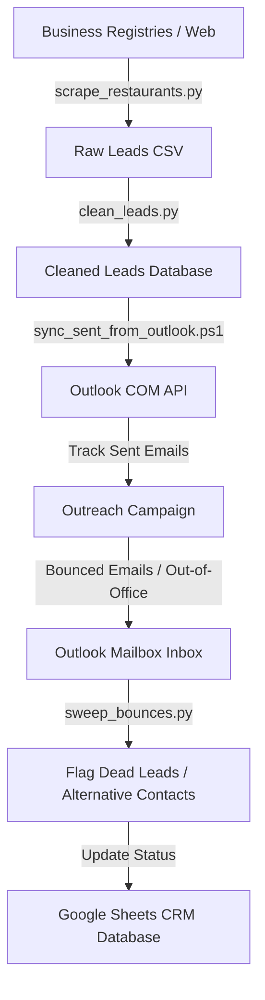

# Process Automation: Lead Harvesting & Bounce Tracking

This repository documents the automation scripts I built to extract, clean, and synchronize local business leads to the central CRM.

---

## ⚙️ Systems Automation Workflow

---

## 🚨 The Problem: Manual Data Extraction & Database Pollution
Manually compiling business leads, validating contact numbers, and checking email bounce boxes takes hours of manual administrative work. Additionally, dirty data (casing errors, duplicates, and dead emails) pollutes the CRM, wasting domain reputation during email outreach.

---

## 💡 The Solution: End-to-End Scraper & Sync Pipeline
I built a multi-stage automation pipeline to replace manual administrative tasks:
* **Data Harvester (`scrape_restaurants.py`):** Python web scrapers that query business registries to extract phone numbers, physical addresses, and coordinates.
* **Leads Cleanser (`clean_leads.py`):** Normalizes name casing (turning "REStauranT lTD" into "Restaurant Ltd"), filters out invalid characters, and deduplicates records.
* **Outreach Syncher (`sync_sent_from_outlook.ps1`):** PowerShell automation utilizing local COM APIs to sweep Outlook folders, identify bounced emails, and flag dead addresses in the GSheets database.

---

## 📈 Business Impact
* **100% Admin Task Reduction:** Replaced manual copy-pasting with automated daily script runs.
* **Outreach Safety:** Deduplicating and sweeping bounces keeps the outbound domain reputation clean, protecting marketing domains from spam filters.
